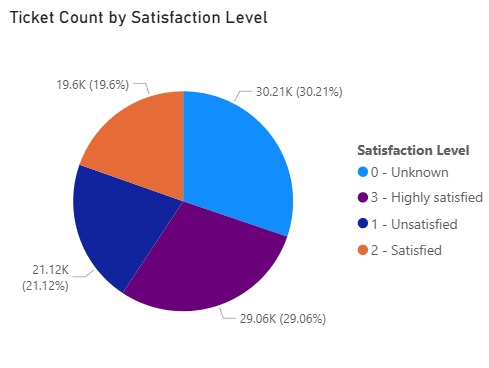

# Enterprise Help‑Desk Performance Analysis Report

## Business Question
**How can the company improve the speed and effectiveness of help‑desk issue resolution to increase customer satisfaction and support future growth?**

This report analyzes help‑desk performance using a cleaned dataset of 100,000 tickets. The goal is to understand which functional areas generate the most demand, how priority levels affect resolution speed, and how satisfaction varies across the organization. These insights directly support the company's focus on improving resolution speed, increasing customer satisfaction, and identifying the root causes of delays.

---

## Data Preparation
Before generating visuals or insights, the compiled Excel dataset required cleaning. This included:

- Removing errors and invalid entries  
- Standardizing formats  
- Handling missing values  
- Removing duplicate records  

Once cleaned, the dataset was loaded into **Microsoft Power BI**. Power BI enabled the creation of visuals that highlight:

- Average resolution times by priority level
- Max resolution times by priority level
- Ticket volume by functional area  
- Satisfaction patterns across the organization  

These visuals make performance trends easier for executives to interpret without reviewing raw data.

---

## Key Insights

### 1. Ticket Volume by Functional Area
Breaking down tickets by each functional area revealed where the help desk spends most of its time:

- **Systems:** 40,035 tickets  
- **Access/Login:** 29,921 tickets  
- **Software:** 20,068 tickets  
- **Login:** 9,976 tickets  

Systems issues generate the highest workload, making them the primary driver of demand. Access/Login issues are the second largest category, suggesting that account management processes may need improvement.

A **stacked bar chart** was used to visualize this distribution because it clearly compares each functional area and its contribution to overall ticket volume.

**Business implication:**  
These areas should be prioritized for efficiency improvements, as they have the greatest impact on customer satisfaction and operational load.

---

### 2. Resolution Time by Priority Level
Analyzing maximum and average days open for each priority level revealed an important pattern:

- **Max days open:** Level 3 (High Priority) tickets remain open the longest.  
- **Average days open:** Level 1 (Low Priority) tickets take the longest on average (8 days), while Level 3 averages only 6 days.

This indicates:

- High‑priority tickets are resolved faster on average, as expected.  
- Low‑priority tickets accumulate and linger, creating a backlog.  
- A few high‑priority outliers remain open for unusually long periods, signaling potential bottlenecks.

A **clustered column chart** was used to compare these categories side by side.

**Business implication:**  
Low‑priority tickets need service‑level agreements to prevent excessive delays. High‑priority outliers should be reviewed to identify workflow issues or complex cases.

---

### 3. Satisfaction Levels by Functional Area
A column chart comparing satisfaction levels across functional areas showed a consistent pattern:

- **0 – Unknown** is the largest category  
- **3 – Highly Satisfied** is the second largest  
- **1 – Unsatisfied** follows  
- **2 – Satisfied** is the smallest group  

This pattern holds across Systems, Access/Login, Software, and Hardware.

**Interpretation:**

- Many customers do not leave a satisfaction rating.  
- Those who do respond tend to be either very happy or very unhappy.  
- Middle‑ground experiences may be underreported.  

A **clustered column chart** was used to highlight these differences.

---

### 4. Overall Satisfaction Distribution
A pie chart summarizing all satisfaction levels shows:

- **Unknown:** 30.21%  
- **Highly Satisfied:** 29.06%  
- **Satisfied:** 19.60%  
- **Unsatisfied:** 21.12%  

The 30% unknown category is a major concern. It reduces confidence in the satisfaction data and may hide underlying issues.

**Business implication:**  
The company should investigate why customers skip the survey and ensure the system reliably captures feedback. Additionally:

- Analyze the 21.12% unsatisfied group for patterns (ticket type, channel, functional area).  
- Leverage the highly satisfied group to identify best practices and potential testimonials.

A **pie chart** was used because it clearly shows how satisfaction levels divide across the entire dataset.

---

## Conclusion
The help desk has a strong foundation but faces several challenges that must be addressed to support future growth:

- **Systems** and **Access/Login** generate the highest ticket volumes and should be prioritized for process improvements.  
- **Low‑priority tickets** remain open too long, creating backlogs that reduce satisfaction.  
- **High‑priority outliers** indicate workflow bottlenecks that require investigation.  
- **Satisfaction data is incomplete**, with nearly one‑third of responses missing, making it difficult to trust the overall picture.

By improving prioritization practices, reducing backlog in low‑priority tickets, and strengthening feedback collection, the company can significantly improve help‑desk efficiency and customer satisfaction.
